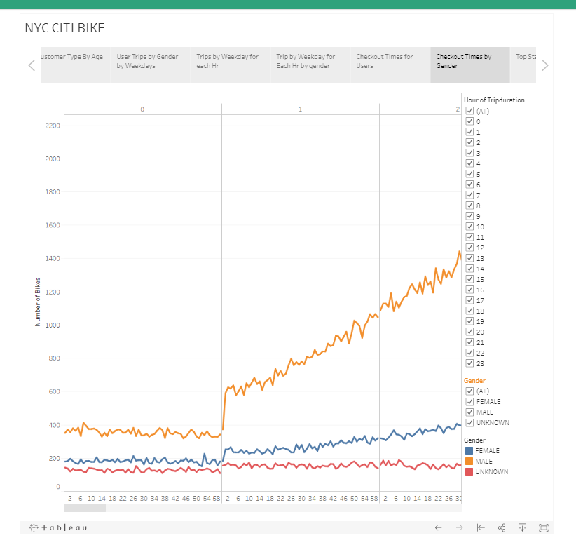

# bikesharing
[link to dashboard](https://public.tableau.com/views/Challenge_CitiBikeNYC/NYCCITIBIKE?:language=en&:display_count=y&publish=yes&:origin=viz_share_link)

## Purpose
The purpose of this assignment was to analyze whether bringing citibike, a bike-sharing service, from New York to Des Moines is a viable business venture.

### Overview
To do this, I analyzed New York City data from Citibike using Tableau. The most relevant metrics reviewed were breakdowns of users types by gender, age, to learn their weekday behaviors in using the bike, check out times, and top starting and ending locations. 

## Results

The results indicat that users are predominantly male and who subscribes to citi bike. In addition, people who are customers and were born in 1970s is the largest  groups. Followed by people who were born in the between 80s-90s.

Male subscribers have higher rate of using the bikes all week. They use the bikes more frequent during communite hours on weekdays. 

The "Checkout Times by Gender graph shows that users tend to use the bikes less and less as trip durations exceed 5 hrs. 

During the weekends, rides are more evenly spread out throughout the day,but the peak hrs centered around morning and evening commutting hours. 

The excess of male group may also suggest further efforts should be made to make citibike more appealing for a female. 

The starting and ending locations mostl overlap, which indicates that people do not travel far form they started. This could be indication to cetner the placement of sharing bikes in high population area

## Summary
In conclusion, given that Des Moines is a relatively small city and not a rural area,  there could be  opportunities for it to develop the bike sharing business.  However the location set up needs to be careful,either for communal purpose of for tourists purpose, where larger population would use the bike to travel around the city. 

